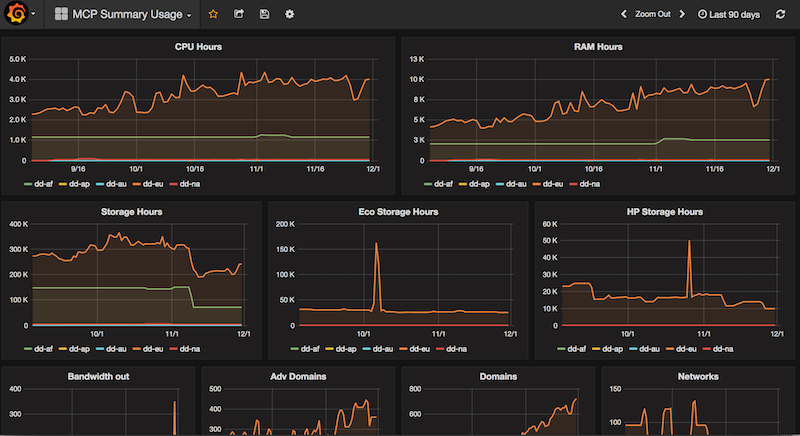
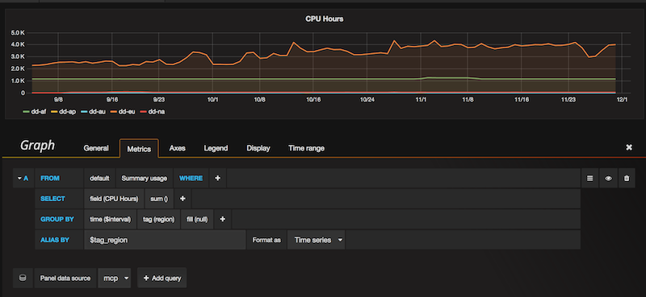

# mcp-pump
Pump logs from the global Managed Cloud Platforma and monitor resource consumption
over time.



## What is this?

Since the API from Dimension Data exposes interesting consumption information,
we show in this project how to build a beautiful dashboard with Grafana and InfluxDB.

## How to do the same?

You will need some elements:
- a computer with Internet access
- MCP credentials
- enough skills to install Grafana and InfluxDB

The following is the very minimum viable product we could design. Thanks for your feed-back and comments.

## Setup steps

### Install InfluxDB as data store

Check [the official installation page for InfluxDB](https://docs.influxdata.com/influxdb/v1.1/introduction/installation/). On ubuntu do the following:

```
$ curl -sL https://repos.influxdata.com/influxdb.key | sudo apt-key add -
$ source /etc/lsb-release
$ echo "deb https://repos.influxdata.com/${DISTRIB_ID,,} ${DISTRIB_CODENAME} stable" | sudo tee /etc/apt/sources.list.d/influxdb.list
$ sudo apt-get update && sudo apt-get install influxdb
$ sudo service influxdb start
```

### Install and start the pump

Put MCP credentials in environment variable:

```
$ export MCP_USERNAME='foo.bar'
$ export MCP_PASSWORD='WhatsUpDoc'
```

You will need git and [Apache Libcloud installed](https://libcloud.readthedocs.io/en/latest/getting_started.html) as pre-requisites.

Download the code from GitHub and run it:

```
$ git clone https://github.com/bernard357/mcp-pump.git
$ cd mcp-pump
$ pip install -r requirements.txt
$ python pump.py
```


### Install Grafana and visualize data

Download the code and run it, as per instructions from [the official installation page of Grafana](http://docs.grafana.org/installation/).
On Ubuntu do the following:

```
$ wget https://grafanarel.s3.amazonaws.com/builds/grafana_4.0.0-1480439068_amd64.deb
$ sudo apt-get install -y adduser libfontconfig
$ sudo dpkg -i grafana_4.0.0-1480439068_amd64.deb
$ sudo service grafana-server start
```

Start the Grafana console from your preferred web browser, then add a data source with
InfluxDB and using the database `mcp`. After that, build the dashboard that you were dreaming of
with fantastic rendering capabilities of Grafana.

Below is an example settings for the widget that reports on CPU hours. Each region has a different line in the diagram, yet this could be segmented by location.



