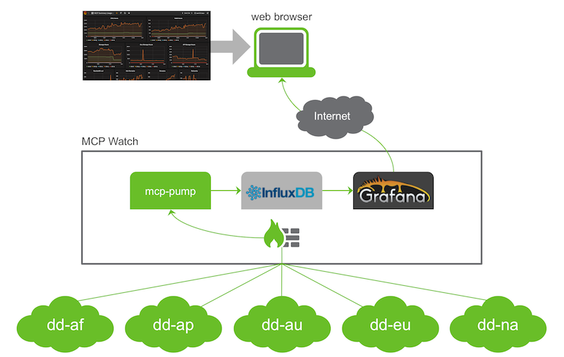
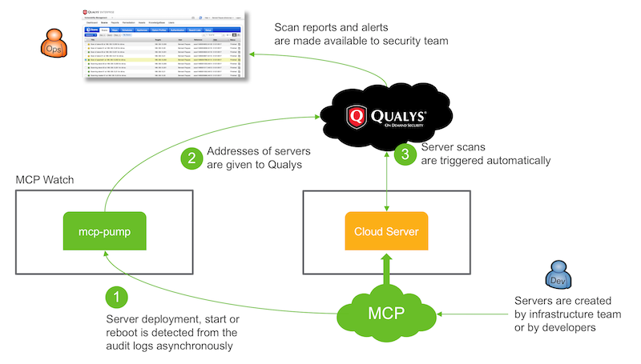

# The MCP Watch project

Pump logs from the global [Managed Cloud Platform](http://www.dimensiondata.com/Global/Solutions/Cloud/) from Dimension Data, monitor resource consumption over time and dig into visual analytics.

Or, sense servers that have been activated, and trigger automated scans on the part of your infrastructure that is exposed to the Internet.

## Why this project?

The cloud API from Dimension Data has been exposing very detailed consumption information since its inception. This provides:
- summary usage report, that presents total of resources used per day and per data centre,
- detailed usage report, that lists resources and periods of consumption,
- audit log, that has all actions performed on the virtual infrastructure either from CloudControl web console or API

Advanced clients are using this comprehensive source of data for various usages, for example:
- monitor consumption of cloud services and ensure that it stays below some threshold
- breakdown consumption reports and show them back to multiple business units
- ingest the audit log into some SIEM system and contribute to cyber-security

However, we could observe that many clients just do not leverage data made available to them, either because they are lacking of analytics back-end and of expertise, or because they are just looking for a lightweight and standalone solution.

MCP Watch is a concrete response to this situation. With this project we provide a beautiful dashboard that can be setup quickly by any practitioner of the Managed Cloud Platform. We also explain how your public servers can be scanned automatically by Qualys less than 2 minutes after their exposure to the Internet.

The project is dedicated to the global community of clients and employees who use cloud services from Dimension Data for their virtual infrastructure. MCP Watch can be used either as an operational dashboard where powerful analytics can be done visually, or as a smart demonstration of Dimension Data API capabilities.

The MCP Watch project is ruled by the [Apache License](https://www.apache.org/licenses/LICENSE-2.0). In other terms, it is an open source project, so we rely on volunteers to show up and to contribute. [Contributions and feedback](docs/contributing.md) are welcome, and they are greatly appreciated! Every little bit helps, and credit will always be given.

## How is this done?

The system has a computer that is constantly pumping data from various MCP regions, and feeding other systems.

The `mcp-pump` piece of software is written in python and relies on the Apache Libcloud for interactions with the API from Dimension Data. Any computer that can run the python interpreter and that can connect to the public Internet is eligible for the MCP Watch. This can be your own workstation for a quick test or for a demo. Or it can be a small computer like a Raspberry Pi. Or any general-purpose computer, really. And, of course, it can be a virtual server running in the cloud.

For consumption analytics, data is sent to an InfluxDB database. Then dynamic dashboards can be built and accessed from a regular web browser, thanks to Grafana.

For automatic security scans, MCP Watch detects servers that have been activated and submits scanning requests to Qualys.

Our mid-term objective is that `mcp-pump` can interface with multiple systems. The architecture is open, so that it can be extended quite easily. We are looking for the addition of Elasticsearch, MongoDB, Cisco Spark and of Splunk. If you are interested, or have other ideas, please have a look at the [contributing page](contributing.md).

## What is needed to deploy MCP Watch?

The minimum viable solution we could think of is really compact:
* a computer that runs `mcp-pump`, and that has access to public Internet over HTTPS,
* MCP credentials so that the pump can fetch data from the Dimension Data API,
* some instructions and goodwill :-)

So, depending of your goal, here are step-by-step instructions that have been prepared just for you:
- [Setup MCP Watch with InfluxDB and Grafana](docs/setup-influxdb-grafana.md)
- [Setup MCP Watch with Qualys](docs/setup-qualys.md)

## Where to find additional assistance?

Well, maybe you would like to check [Frequently asked questions](docs/questions.md) and related responses.
Then you can [raise an issue at the GitHub project page](https://github.com/bernard357/mcp-pump/issues) and get support from the project team.

If you are a Dimension Data employee, reach out the Green Force group at Yammer and engage with
other digital practitioners.

## How would you like to contribute?

We want you to feel as comfortable as possible with this project, whatever your skills are.
Here are some ways to contribute:

* [use it for yourself](docs/contributing.md#how-to-use-this-project-for-yourself)
* [communicate about the project](docs/contributing.md#how-to-communicate-about-the-project)
* [submit feedback](docs/contributing.md#how-to-submit-feedback)
* [report a bug](docs/contributing.md#how-to-report-a-bug)
* [write or fix documentation](docs/contributing.md#how-to-improve-the-documentation)
* [fix a bug or an issue](docs/contributing.md#how-to-fix-a-bug)
* [implement some feature](docs/contributing.md#how-to-implement-new-features)

Every [contribution and feedback](docs/contributing.md) matters, so thank you for your efforts.
