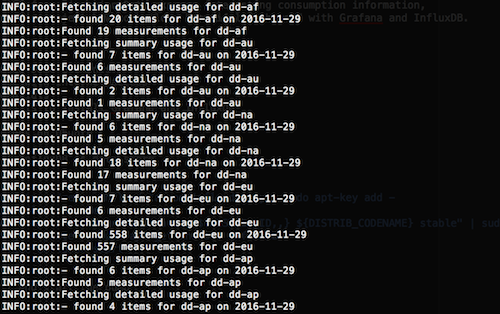

# Setup MCP Watch with InfluxDB and Grafana

On this page you will find instructions to install [MCP Watch](https://github.com/bernard357/mcp-pump) with [InfluxDB](https://www.influxdata.com/time-series-platform/influxdb/) and [Grafana](http://grafana.org/).


Everything you need can be installed on one single computer, or on multiple:
- the `mcp-pump` software
- the InfluxDB database
- the Grafana web dashboard

The computer that will run `mcp-pump` should be given access to public Internet, so that it
can interact with the API endpoints and fetch data from them.

## Install InfluxDB as data store

[InfluxDB](https://www.influxdata.com/time-series-platform/influxdb/) is an open source database written in Go specifically to handle time series data with high availability and high performance requirements. InfluxDB installs in minutes without external dependencies, yet is flexible and scalable enough for complex deployments.

Check [the official installation page for InfluxDB](https://docs.influxdata.com/influxdb/v1.1/introduction/installation/). This can run on RedHat, CentOS, Ubuntu and on MAC OS X. On Ubuntu do the following:

```
$ curl -sL https://repos.influxdata.com/influxdb.key | sudo apt-key add -
$ source /etc/lsb-release
$ echo "deb https://repos.influxdata.com/${DISTRIB_ID,,} ${DISTRIB_CODENAME} stable" | sudo tee /etc/apt/sources.list.d/influxdb.list
$ sudo apt-get update && sudo apt-get install influxdb
$ sudo service influxdb start
```

## Install the pump

For this installation you need a computer that can run python programs,
plus some tools to download software from python public repository, and from GitHub.

Pre-requisites:
- [libyaml-dev](http://packages.ubuntu.com/search?keywords=libyaml-dev) 
- [python-dev](http://packages.ubuntu.com/search?keywords=python-dev)
- [python 2.7 and pip](https://www.python.org/downloads/)
- [pyYAML](http://pyyaml.org/)
- [backports.ssl_match_hostname] (https://pypi.python.org/pypi/backports.ssl_match_hostname)
- [git](https://git-scm.com/downloads)
- [Apache Libcloud](https://libcloud.readthedocs.io/en/latest/getting_started.html)

As an overall example, if you use a Ubuntu or macOs machine, you could do the following:

```bash
$ sudo apt-get install -y ntp python-pip git
$ sudo apt-get install libyaml-dev
$ sudo apt-get install python-dev
$ sudo pip install --user PyYAML
$ sudo pip install backports.ssl_match_hostname
$ sudo pip install apache-libcloud
$ cd ~
$ git clone https://github.com/bernard357/mcp-pump.git
$ cd mcp-pump
$ pip install -r requirements.txt
```


## Configure the pump

All configuration parameters have been centralised in a single file used by `mcp-pump`:

```
$ sudo nano config.py
```

Every module has a separate section, so it should be easy to move around.
Check the InfluxDB section and ensure that the module has been activated.
For example if you are using a local server with default settings:

```
influxdb = {
    'active': True,
    'host': 'localhost',
    'port': 8086,
    'user': 'root',
    'password': 'root',
    'database': 'mcp',
    }
```

Save changes with `Ctl-O` and exit the editor with `Ctl-X`.

Put MCP credentials in environment variables:

```
$ export MCP_USER='foo.bar'
$ export MCP_PASSWORD='WhatsUpDoc'
```

For permanent changes you may put these variables in a file
that is loaded automatically by the operating system.

For example if you are running Ubuntu or macOs you could do:

```
$ nano ~/.bash_profile
```

and type text like the following:

```
# MCP credentials
export MCP_USER='foo.bar'
export MCP_PASSWORD='WhatsUpDoc'

```

Save changes with `Ctl-O` and exit the editor with `Ctl-X`.
Then close all terminal windows, and re-open one to ensure that environment variables have been updated.

## Start the pump

If you start with an empty database then indicate how much data you would like to retrieve from the past.
For example here is the command that will fetch daily logs for the past quarter:

```bash
$ python pump.py 3m
```



Note: do not use the same command if the database has been populated, else logs would be recorded multiple times.
On normal operation, just restart the pump on the current day like this:

```bash
$ python pump.py
```

## Install Grafana and visualize data

[Grafana](http://grafana.org/) is an open source metric analytics & visualization suite. It is most commonly used for visualizing time series data for infrastructure and application analytics but many use it in other domains including industrial sensors, home automation, weather, and process control.

Download the code and run it, as per instructions from [the official installation page of Grafana](http://docs.grafana.org/installation/). Almost any operating system, including Windows, can be used for a Grafana back-end server.
On Ubuntu do the following:

```
$ wget https://grafanarel.s3.amazonaws.com/builds/grafana_4.0.0-1480439068_amd64.deb
$ sudo apt-get install -y adduser libfontconfig
$ sudo dpkg -i grafana_4.0.0-1480439068_amd64.deb
$ sudo service grafana-server start
```

Start the Grafana console from your preferred web browser, then add a data source with
InfluxDB and using the database `mcp`. After that, build the dashboard that you were dreaming of
with fantastic rendering capabilities of Grafana.

Below is an example settings for the widget that reports on CPU hours. Each region has a different line in the diagram, yet this could be segmented by location to get more details.


## Where to go from here?

Visit [the frequently asked questions page](questions.md) since it contains a lot of information that may prove useful.
Then you can [raise an issue at the GitHub project page](https://github.com/bernard357/mcp-pump/issues) and get support from the project team.
If you are a Dimension Data employee, reach out the Green Force group at Yammer and engage with
other digital practitioners.

On the other hand, if you are happy with this project, we would be happy to receive some [feedback or contribution](docs/contributing.md) in return.
We want you to feel as comfortable as possible with this project, whatever your skills are.
Here are some ways to contribute:

* [use it for yourself](docs/contributing.md#how-to-use-this-project-for-yourself)
* [communicate about the project](docs/contributing.md#how-to-communicate-about-the-project)
* [submit feedback](docs/contributing.md#how-to-submit-feedback)
* [report a bug](docs/contributing.md#how-to-report-a-bug)
* [write or fix documentation](docs/contributing.md#how-to-improve-the-documentation)
* [fix a bug or an issue](docs/contributing.md#how-to-fix-a-bug)
* [implement some feature](docs/contributing.md#how-to-implement-new-features)

Our mid-term objective is that `mcp-pump` can interface with various analytics systems. The architecture is open, so that it can be extended quite easily. We are looking for the addition of Elasticsearch/Kibana and of MongoDB. If you are interested, please have a look at the [contributing page](contributing.md).


